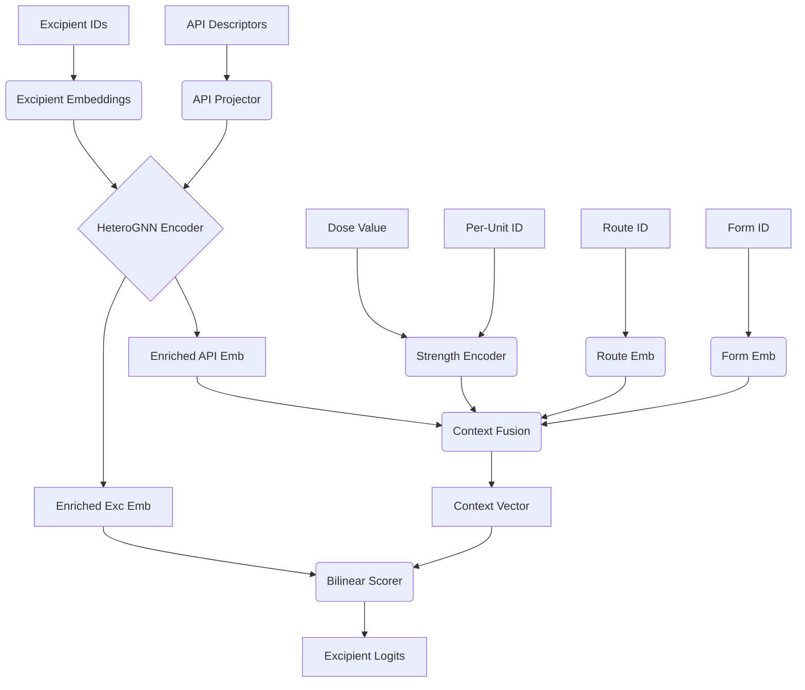

# ExciPick Heterogeneous GNN Model Architecture

This directory contains the implementation of the **ExciPick Heterogeneous Graph Neural Network (HGNN) Model**, an advanced machine learning model designed to predict appropriate excipients for pharmaceutical formulations given a target Active Pharmaceutical Ingredient (API), its dose, administration route, and dosage form.

The model represents the interactions between APIs and Excipients as a heterogeneous graph, enabling the model to learn complex relationships between molecules and formulation components through message passing, before fusing these structural embeddings with formulation context (dose, route, form) to score candidate excipients.

## Architecture Overview

The pipeline of the `ExciPickHGNN` (defined in `FULL_MODEL.py`) consists of five major stages:

1. **Initial Node Feature Projection** (`api_encoder.py` & Embeddings)
2. **Heterogeneous Graph Message Passing** (`gnn_layers.py`)
3. **Formulation Encoding** (`strength_encoder.py` & Route/Form Embeddings)
4. **Context Fusion** (`context_fusion.py` equivalent logic inside `FULL_MODEL.py`)
5. **Excipient Scoring** (`excipient_scorer.py`)

---

## 1. Initial Node Feature Projection

Before message passing can occur, node features for APIs and Excipients must be projected into a shared hidden dimension (`gnn_hidden`).

* **API Nodes:** API nodes begin with 20 raw molecular descriptors. The `APIProjector` (`api_encoder.py`) uses a linear layer followed by `LayerNorm` and a `ReLU` activation to project these 20-dimensional features into the `gnn_hidden` dimension.
* **Excipient Nodes:** Excipient nodes do not use continuous features initially. Instead, they are represented by an `nn.Embedding` lookup table of shape `(vocab_size, gnn_hidden)`.

## 2. Heterogeneous Graph Message Passing

The `HeteroGNNEncoder` (`gnn_layers.py`) handles the message passing over the bipartite API-Excipient graph.

* **Layer Construction:** The encoder uses a multi-layer structure where each layer leverages PyTorch Geometric's `HeteroConv`. Inside `HeteroConv`, a dedicated `SAGEConv` (GraphSAGE) layer is used for each specific edge type in the graph.
* **Message Passing & Update:** In each layer, nodes aggregate messages from their neighbors. After aggregation, the model applies a residual connection (`x + x_new`), `LayerNorm` (per node type), a `ReLU` activation, and Dropout.
* **Output:** The output of this stage is a dictionary of *enriched* node embeddings (`enriched_api` and `enriched_exc`), where both APIs and excipients have absorbed relational graph information from their neighbors.

## 3. Formulation Encoding

Alongside the graph information, the model needs to understand the specific formulation requirements.

* **Strength (Dose) Encoding (`strength_encoder.py`):** The model receives a continuous `dose` value and a categorical `per_unit` type. The `per_unit` type is embedded via `nn.Embedding`. The raw `dose` and the `per_unit` embedding are concatenated and passed through a linear layer and `ReLU` activation to produce a `strength_out` vector.
* **Route & Form Encoding:** The administration route and dosage form are categorical variables. They are embedded using separate standard `nn.Embedding` layers into `route_emb` and `form_emb` dimensions.

## 4. Context Fusion

Once all the components are encoded, they are merged into a single formulation context vector representing the specific instance being predicted.

Inside the `forward` pass of `ExciPickHGNN`:
1. The batch-specific *enriched* API embeddings are looked up from the GNN output (`enriched_api[api_idx]`).
2. The batch API, strength, route, and form embeddings are concatenated along the feature dimension.
3. This concatenated vector is passed through the `fusion` network (Linear $\rightarrow$ LayerNorm $\rightarrow$ ReLU $\rightarrow$ Dropout) to produce a unified `context_out` vector representing the holistic formulation state.

## 5. Excipient Scoring

The final step is to score all possible excipients to predict which ones belong in the formulation.

* **Bilinear Scorer (`excipient_scorer.py`):** The `Scorer` module calculates a compatibility score between the fused `context` vector and the GNN-enriched excipient embeddings (`exc_embs`).
* It utilizes an `nn.Bilinear` layer. The `context` and `exc_embs` are mathematically expanded/tiled so that every formulation context in the batch is evaluated against every excipient in the vocabulary.
* **Output:** The result is a `(Batch_size, Vocab_size)` tensor of raw logit scores, indicating the predicted likelihood of each excipient being present in the specific formulation.

---

## Data Flow Summary

